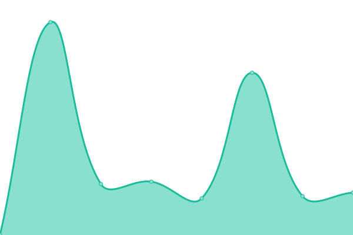

# [📈 Live Status](https://globerunnerseo.github.io/downtime): <!--live status--> **🟩 All systems operational**

This repository contains the open-source uptime monitor and status page for [Globe Runner](https://globerunner.com), powered by [Upptime](https://github.com/upptime/upptime).

With [Upptime](https://upptime.js.org), you can get your own unlimited and free uptime monitor and status page, powered entirely by a GitHub repository. We use [Issues](https://github.com/globerunnerseo/downtime/issues) as incident reports, [Actions](https://github.com/globerunnerseo/downtime/actions) as uptime monitors, and [Pages](https://globerunnerseo.github.io/downtime) for the status page.

<!--start: status pages-->
<!-- This summary is generated by Upptime (https://github.com/upptime/upptime) -->
<!-- Do not edit this manually, your changes will be overwritten -->
<!-- prettier-ignore -->
| URL | Status | History | Response Time | Uptime |
| --- | ------ | ------- | ------------- | ------ |
|  [Globe Runner](https://globerunner.com/) | 🟩 Up | [globe-runner.yml](https://github.com/globerunnerseo/downtime/commits/HEAD/history/globe-runner.yml) | 

 290ms
     
 | 

<a href="https://globerunnerseo.github.io/downtime/history/globe-runner">99.64%</a>
    

|  [Loco Drive In](https://www.locodrivein.com/) | 🟩 Up | [loco-drive-in.yml](https://github.com/globerunnerseo/downtime/commits/HEAD/history/loco-drive-in.yml) | 

 273ms
     
 | 

<a href="https://globerunnerseo.github.io/downtime/history/loco-drive-in">100.00%</a>
    

|  [Realtime Labs](https://realtimelab.com/) | 🟩 Up | [realtime-labs.yml](https://github.com/globerunnerseo/downtime/commits/HEAD/history/realtime-labs.yml) | 

 338ms
     
 | 

<a href="https://globerunnerseo.github.io/downtime/history/realtime-labs">99.65%</a>
    

|  [Precision Warehouse](https://precisionwarehousedesign.com/) | 🟩 Up | [precision-warehouse.yml](https://github.com/globerunnerseo/downtime/commits/HEAD/history/precision-warehouse.yml) | 

 298ms
     
 | 

<a href="https://globerunnerseo.github.io/downtime/history/precision-warehouse">99.66%</a>
    

<!--end: status pages-->

[**Visit our status website →**](https://globerunnerseo.github.io/downtime)

## 📄 License

- Powered by: [Upptime](https://github.com/upptime/upptime)
- Code: [MIT](./LICENSE) © [Globe Runner](https://globerunner.com)
- Data in the `./history` directory: [Open Database License](https://opendatacommons.org/licenses/odbl/1-0/)
